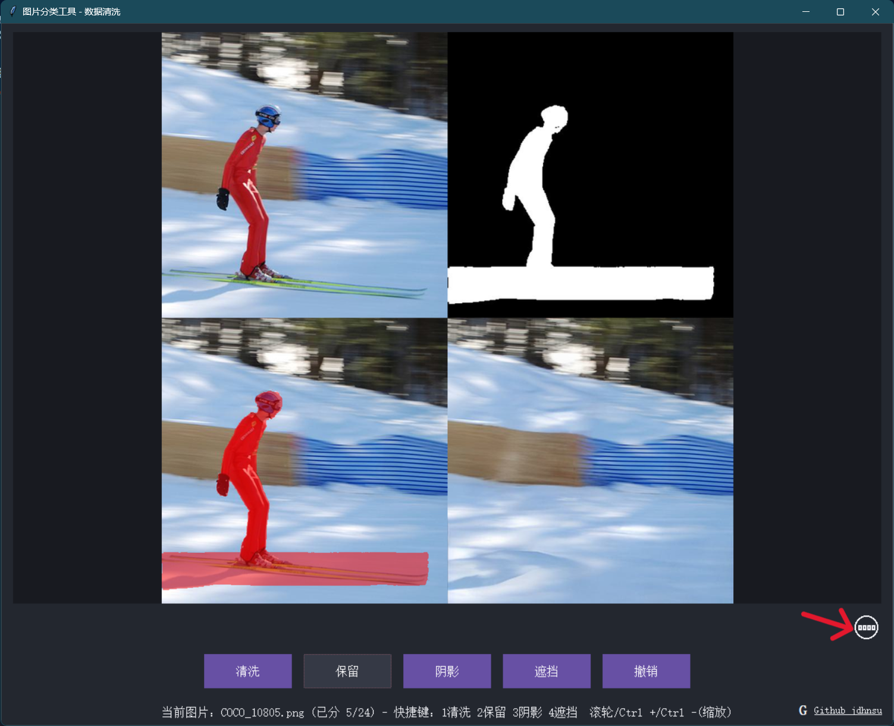

# 图片分类工具 - 数据清洗

本工具用于高效筛选和分类拼接大图（原图/掩码/修剪图），支持图片四图横向展示、分类、撤销、缩放、拖动、快捷键。适合数据清洗、标注辅助等场景。

---

## 目录
- [功能简介](#功能简介)
- [使用打包的 .exe 程序（推荐）](#使用打包的exe程序推荐)
  - [1. 准备图片](#1-准备图片)
  - [2. 运行程序](#2-运行程序)
  - [3. 操作说明](#3-操作说明)
- [使用源文件运行（Python环境）](#使用源文件运行python环境)
  - [1. 安装依赖](#1-安装依赖)
  - [2. 运行主程序](#2-运行主程序)
- [常见问题](#常见问题)
- [联系方式](#联系方式)

---

## 功能简介
- 支持拼接大图（原图/掩码/修剪图）自动等宽裁剪，生成“原/掩码/标注/修剪”四图横向展示。
- 支持图片分类（清洗/保留/阴影/遮挡），一键移动图片到对应文件夹。
- 支持撤销、快捷键操作、图片缩放、拖动、方向键平移。
- 界面美观，深色风格，支持窗口自适应。
---

## 使用打包的.exe程序（推荐）

### 1. 准备图片
- 将`程序`与所有待分类的拼接大图（如 `COCO_10801.png` 等）放入同一文件夹。

> **示例图片结构：**
> 
> - COCO_10801.png
> - COCO_10802.png
> - ...
> 
> 

### 2. 运行程序
- 双击运行已打包好的 `1_data_q.exe` 文件。
- 首次运行会自动创建 `清洗`、`保留`、`阴影`、`遮挡` 四个分类文件夹。
- 启动后会弹出图片选择界面，选择要开始的图片，点击“确定”。


### 3. 操作说明
- **图片展示区**：横向展示“原图/掩码/标注/修剪”四图。
- **分类按钮**：点击“清洗/保留/阴影/遮挡”按钮，图片会被移动到对应文件夹。
- **撤销**：点击“撤销”按钮可撤回上一步分类。
- **快捷键**：
    - `1`：清洗
    - `2`：保留
    - `3`：阴影
    - `4`：遮挡
    - `z`：撤销
    - 方向键：平移图片
    - 鼠标滚轮：缩放图片
    - 拖动图片：按住鼠标左键拖动
- **窗口自适应**：可自由调整窗口大小，图片自适应居中。
- **排版切换**：箭头所指处可切换 1 * 4 排版或 2 * 2 排版。

> 

---

## 使用源文件运行（Python环境）(可忽略)

### 1. 安装依赖
确保已安装 Python 3.7+，推荐使用 Anaconda 或 venv 虚拟环境。

```bash
pip install pillow
```

### 2. 运行主程序
在命令行进入图片所在目录，运行：

```bash
python data_q.py
```

其余操作与打包版一致。

---

---

## 常见问题
- **Q: 图片未显示/报错？**
  - 请确认图片为三图横向拼接，且格式为 jpg/png/bmp/gif。
  - 检查图片是否被其他程序占用。
- **Q: 分类后图片去哪了？**
  - 图片会被移动到同目录下的对应分类文件夹。
- **Q: 如何批量撤销？**
  - 目前仅支持逐步撤销。
- **Q: 运行缓慢？**
  - 程序已做分段缓存优化，若图片极大可适当分批处理。

---

## 联系方式
- GitHub: [jdhnsu](https://github.com/jdhnsu)
- Issues/建议请在 GitHub 提交

---

> _如需定制功能或遇到问题，欢迎联系作者！_
